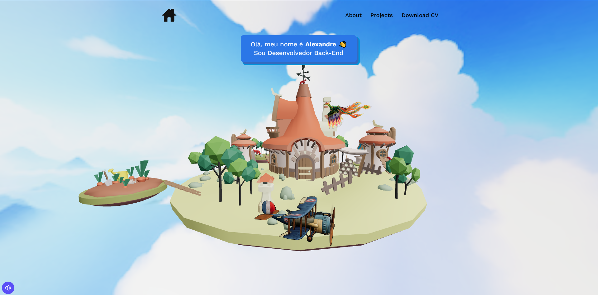

# 🌟 Portfólio 3D em ReactJS
<!-- Inserir imagem no README -->
<p align="center">
  
</p>


Bem-vindo ao repositório do meu portfólio 3D! Este projeto foi desenvolvido com o objetivo de destacar minhas habilidades como desenvolvedor de software, utilizando tecnologias modernas como ReactJS e bibliotecas 3D para criar uma experiência interativa e envolvente.

## 🎯 Objetivo

Este portfólio foi criado para demonstrar minha trajetória, habilidades técnicas, projetos desenvolvidos e minha transição de carreira da logística para a tecnologia. Além disso, ele serve como um exemplo das minhas capacidades em design e desenvolvimento de aplicações frontend.

## 📖 Sobre o Projeto

Este portfólio utiliza:

- **ReactJS**: Framework JavaScript para construção da interface.
- **Three.js**: Biblioteca JavaScript para renderização e animação 3D.
- **Tailwind CSS**: Framework CSS para estilização rápida e eficiente.
- **Vite**: Ferramenta para desenvolvimento frontend moderno e rápido.
- **PostCSS**: Processador CSS para funcionalidades avançadas.

### Funcionalidades Principais

- Exibição de projetos em uma interface 3D interativa.
- Links para redes sociais e repositórios públicos.
- Informações detalhadas sobre minhas habilidades, experiências e formação.
- Design responsivo para uma experiência otimizada em dispositivos móveis e desktops.

## 🚀 Tecnologias Utilizadas

- **Frontend**: ReactJS, Three.js, HTML5, CSS3, Tailwind CSS
- **Gerenciamento de Dependências**: Node.js, npm
- **Build Tool**: Vite
- **Controle de Versão**: Git e GitHub

## 📂 Estrutura do Repositório

```
/
├── public/              # Arquivos públicos do projeto
├── src/                 # Código-fonte principal
│   ├── components/      # Componentes reutilizáveis
│   ├── pages/           # Páginas do portfólio (Home, About, Contact, Projects)
│   ├── assets/          # Imagens, ícones e outros recursos estáticos
│   ├── constants/       # Constantes reutilizáveis
│   ├── hooks/           # Hooks personalizados
│   ├── models/          # Modelos de dados
│   ├── index.css        # Estilo global
│   └── main.jsx         # Ponto de entrada principal
├── .env                 # Variáveis de ambiente
├── package.json         # Dependências e scripts do projeto
├── vite.config.js       # Configuração do Vite
├── tailwind.config.js   # Configuração do Tailwind CSS
├── postcss.config.js    # Configuração do PostCSS
└── README.md            # Documentação do repositório
```

## ⚙️ Como Executar Localmente

1. **Clone o Repositório:**

```bash
git clone https://github.com/AlexandreLiberatto/Portfolio-3D.git
```

2. **Instale as Dependências:**

```bash
cd Portfolio-3D
npm install
```

3. **Execute o Projeto:**

```bash
npm run dev
```

4. **Acesse no Navegador:**

Abra `http://localhost:5173` no seu navegador.

## 🙌 Sobre Mim

Meu nome é **Alexandre Liberato**. Sou um desenvolvedor de software apaixonado e dedicado, em transição da logística para o mundo da tecnologia. Atualmente, estou cursando **Análise e Desenvolvimento de Sistemas** e me especializando em tecnologias como **ReactJS**, **Node.js** e **Java**.

### Vamos Conectar?

- **WhatsApp**: [Clique aqui](https://api.whatsapp.com/send?phone=+5584991604054)
- **LinkedIn**: [Alexandre Liberato](https://www.linkedin.com/in/alexandreliberato/)

## 📝 Licença

Este projeto está sob a licença MIT. Consulte o arquivo LICENSE para obter mais informações.

---

💡 Sinta-se à vontade para explorar, usar e contribuir para este projeto!

